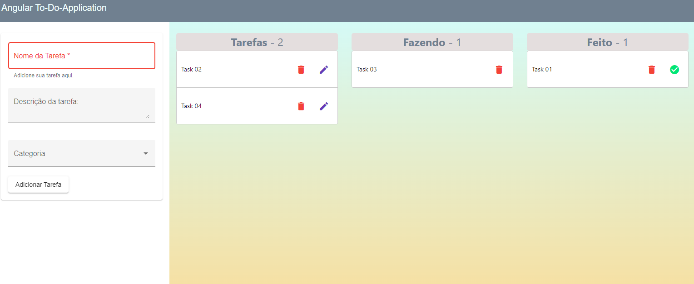

# AngulartoDo01

Projeto de uma aplicação TO-DO, com adição, edição de título, classificação como feita utilizando drag-and-drop e apagar tarefa.

Linguagem: typescript
Framework: Angular 13, Bootstrap, Angular Material.

Implementações a fazer: descrição da tarefa, categorização e ordenação, delimitação da data.

Projeto baseado no vídeo 
https://www.youtube.com/watch?v=WTn2nVphSl8&t=2704s

Layout da página.

